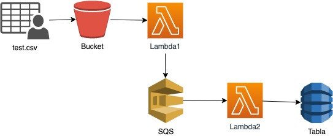
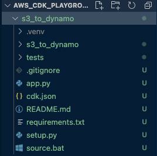
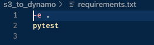
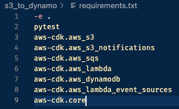
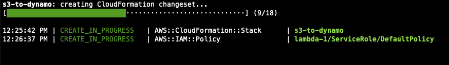
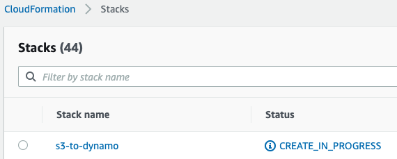
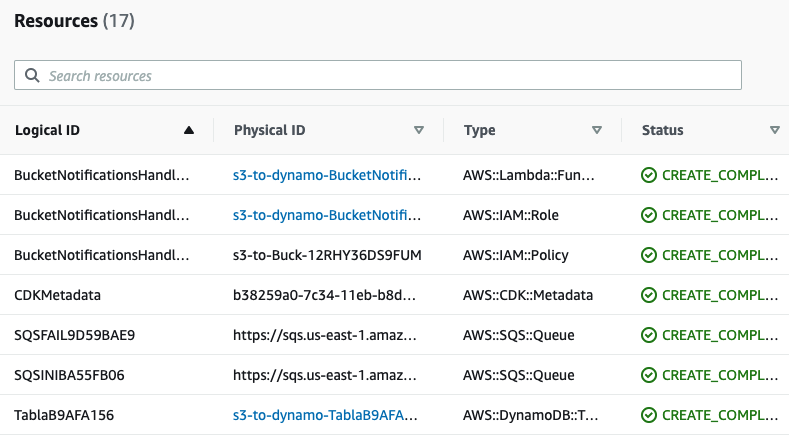
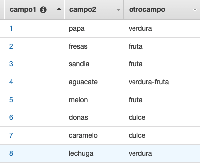
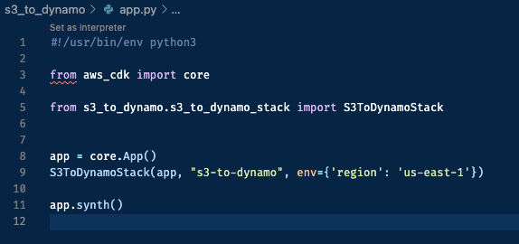

# AWS_CDK_playground

# Crea un cargador de archivos CSV a DynamodB en menos de 5 minutos

Este programa sencillo en CDK, pero extremadamente útil, te va a servir para que te introduzcas en el mundo de la programación CDK con python. 

## La Aplicación:
Está aplicación será capaz de tomar un archivo CSV de un bucket y cargara su contenido en una tabla DynamodB. 




### 1. Creemos la carpeta de nuestro proyecto. 

```
mkdir s3_to_dynamo
```

### 2. Iniciamos el ambiente CDK

```
cd s3_to_dynamo

cdk init sample-app --language python
```
Este ultimo comando te mostrará una breve descripción del ambiente además de los comandos necesarios para continuar con el despliegue de la APP (los cuales tambien se guardan en el [README.md](https://github.com/elizabethfuentes12/AWS_CDK_playground/tree/main/s3_to_dynamo/README.md)) y también generará una serie de carpetas necesarias para que funcione el ambiente CDK



### 3. Activamos el ambiente

```
source .venv/bin/activate
```

### 4. Generamos nuestro codigo. 
En el GitHub el codigo esta listo para desplegar, a continuación una breve explicación. 

- El .py "orquestador" de nuestra aplicación se crea en el ***Paso 2*** con el nombre compuesto de la carpeta y la palabra ***_stack*** al final [s3_to_dynamo_stack.py](https://github.com/elizabethfuentes12/AWS_CDK_playground/tree/main/s3_to_dynamo/s3_to_dynamo/s3_to_dynamo_stack.py)


- Creamos el bucket con el comando: 
```
bucket = s3.Bucket(self,"s3-dynamodb" ,  versioned=False, removal_policy=core.RemovalPolicy.DESTROY)
```
Para que la creación sea exitosa se debe tener en cuenta la libreria que lo permita: 

```
aws_s3 as s3
```

- Creamos el SQS que recibirá los mensajes de Lambda1: 

Agregamos la libreria: 

```
aws_sqs as sqs
```

Y creamos SQS con los siguientes comandos: 

```
queue_fail_SQS = sqs.Queue(
            self, "SQS-FAIL-", visibility_timeout=core.Duration.seconds(30))
dead_letter_SQS = sqs.DeadLetterQueue(
            max_receive_count=10, queue=queue_fail_SQS)
queue_SQS = sqs.Queue(self, "SQS-INI-", visibility_timeout=core.Duration.seconds(
            30), dead_letter_queue=dead_letter_SQS)
```

- Creamos la lambda que se gatilla con el archivo nuevo en el bucket:

Agregamos la libreria: 

```
aws_lambda
```
Creamos la Lambda con el siguiente comando, puedes notar que se le agrega la url de SQS en las variables de enntorno. 

```
lambda_1 = aws_lambda.Function(self, "lambda-1",
                                    runtime=aws_lambda.Runtime.PYTHON_3_8,
                                    handler="lambda_function.lambda_handler",
                                    timeout=core.Duration.seconds(20),
                                    memory_size=256, description= "Lambda que lee bucket y envia a SQS",
                                    code=aws_lambda.Code.asset("./lambda_1"),
                                    environment={'ENV_SQS_QUEUE': queue_SQS.queue_url,
                                    'ENV_REGION_NAME': REGION_NAME
                                      })
```

El codigo de esta lambda se encuentra en la carpeta [/lambda_1](https://github.com/elizabethfuentes12/AWS_CDK_playground/tree/main/s3_to_dynamo/lambda_1)

Le agregamos permiso para leer de S3 y se agrega el evento que la activara 

```
        bucket.grant_read(lambda_1)   
        notification = aws_s3_notifications.LambdaDestination(lambda_1)
        bucket.add_event_notification(s3.EventType.OBJECT_CREATED, notification)
```
Agregamos la libreria que permite las notificaciones de S3: 

```
aws_s3_notifications
```
Esta lambda lee el archivo CSV y envia linea a linea a la SQS, por lo cual debemos crear la SQS darle los permisos correspondientes a la lamnda. 

```
queue_SQS.grant_send_messages(lambda_1)
```

- Creamos la tabla DynamoDB

Agregamos la libreria: 

```
aws_dynamodb as ddb
```
Creamos la tabla con los siguientes comandos: 

```
ddb_table = ddb.Table(
            self, "Tabla",
            partition_key=ddb.Attribute(name="campo1", type=ddb.AttributeType.STRING),
            sort_key=ddb.Attribute(name="campo2", type=ddb.AttributeType.STRING),
            removal_policy=core.RemovalPolicy.DESTROY)
```
Al igual que el bucket le activamos que se destruya al eliminar el stack. 

- Creamos la lambda que se gatilla con la SQS y escribe en Tabla:

Creamos a Lambda2 con el siguiente comando:
```
lambda_2 = aws_lambda.Function(self, "lambda_2",
                                    runtime=aws_lambda.Runtime.PYTHON_3_8,
                                    handler="lambda_function.lambda_handler",
                                    timeout=core.Duration.seconds(20),
                                    memory_size=256, description= "Lambda lee SQS y escribe en DDB",
                                    code=aws_lambda.Code.asset("./lambda_2"),
                                    environment={'ENV_SQS_QUEUE': queue_SQS.queue_url,
                                          'ENV_REGION_NAME': REGION_NAME
                                      })
```


Le damos permiso para escribir en la tabla

```
        ddb_table.grant_write_data(lambda_2)   
        lambda_2.add_environment("TABLE_NAME_FINAL", ddb_table.table_name)
```

Permiso para leer de SQS en la tabla
    
```queue_SQS.grant_consume_messages(lambda_2)
```

EL evento que gatilla la lambda
```
        event_source = aws_lambda_event_sources.SqsEventSource(
            queue_SQS, batch_size=1)
        lambda_2.add_event_source(event_source) 
```

Para poder agregar el evento debemos tener en cuenta la siguiente librería:  

```
aws_lambda_event_sources
```

El código de esta lambda se encuentra en la carpeta [/lambda_2](https://github.com/elizabethfuentes12/AWS_CDK_playground/tree/main/s3_to_dynamo/lambda_2)

## ¡¡Felicidades!! ya estamos casi listos para desplegar nuestra aplicación


### 4. Instalamos los requerimientos para el ambiente de python 

Para que el ambiente pueda funcionar, debemos agregar todas las librerías necesarias en el archivo  [requirements.txt](https://github.com/elizabethfuentes12/AWS_CDK_playground/tree/main/s3_to_dynamo/requirements.txt)

Cuando se crea el archivo su contenido es el siguiente: 



Para este despliegue debe tener el siguiente contenido: 



Una vez actualizado el archivo procedemos a instalar las librerías dentro del ambiente con el comando:

```
pip install -r requirements.txt
```
Esto tardará algunos segundos. 

### 5. Desplegando la aplicación

Previo al despliegue de la aplicación en AWS Cloud debemos asegurarnos que este sin errores para que no salten errores durante el despliegue, eso lo hacemos con el siguiente comando:

```
cdk synth
```

Si hay algún error en tu código este comando te indicara cual es con su ubicación.  

En el caso de estar cargando una nueva version de la apliación puedes revisar que es lo nuevo con el siguiente comando: 

```
cdk diff
```

Procedemos a desplegar la aplicación: 

```
cdk deploy
```

Puedes ver el estado del despliegue en el terminal: 



ó en la consola: 



Una vez finalizado el despligue puedes ver los recursos creados: 




### 6. Prueba

Para probar la aplicación busca el bucket en los recursos y agrega el archivo [ejemplo.csv](https://github.com/elizabethfuentes12/AWS_CDK_playground/blob/main/ejemplo.csv)

Y en solo unos segundos puedes ver que tenemos el contenido del csv en la Tabla de DynamoDB




### 7. Tips


Puedes ver en que región se va a desplegar tu stack en el archivo [app.py](https://github.com/elizabethfuentes12/AWS_CDK_playground/blob/main/s3_to_dynamo/app.py)





### 8. Eliminar el stack de la aplicación

Para eliminar el stack lo puedes hacer via comando:

```
cdk destroy
```

ó via consola en Delete. 
