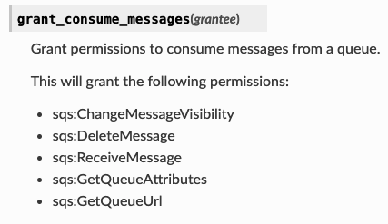

# AWS_CDK_playground

# Crea un cargador de archivos CSV a DynamodB en menos de 5 minutos

Últimamente he estado desarrollado algunas aplicaciones que han requerido alimentar una base de datos desde archivos CSV, por lo que se me ocurrió tener un stack de CDK listo para estas situaciones el cual les comparto. 

En este tutorial les voy a enseñar como crear una aplicación sencilla en CDK con Python, pero extremadamente útil, que se encarga de leer un archivo .CSV de un bucket S3 con una Lambda (Lambda1), envía cada línea a SQS, la cual gatilla otra Lambda (Lambda2) que se encarga de escribir línea a línea en DynamoDB.


Antes de empezar hablemos un poco de la teoría. 

### S3 (Simple Storage Service):
Es un servicio de almacenamiento de objetos que ofrece escalabilidad, disponibilidad de datos, seguridad y rendimiento líderes en el sector. 

Conoce más acá: [S3](https://aws.amazon.com/es/s3/)

### Lamdba: 
AWS Lambda es un servicio informático sin servidor que le permite ejecutar código sin aprovisionar ni administrar servidores, crear una lógica de escalado de clústeres basada en la carga de trabajo, mantener integraciones de eventos o administrar tiempos de ejecución.

Conoce más acá: [Lambda](https://aws.amazon.com/es/lambda/)

### SQS (Simple Queue Service):
Es un servicio de colas de mensajes completamente administrado que permite desacoplar y ajustar la escala de microservicios, sistemas distribuidos y aplicaciones sin servidor. SQS elimina la complejidad y los gastos generales asociados con la gestión y el funcionamiento del middleware orientado a mensajes, y permite a los desarrolladores centrarse en la diferenciación del trabajo.

Conoce más acá: [SQS](https://aws.amazon.com/es/sqs/)

### DynamoDB:
Amazon DynamoDB es un servicio de base de datos de NoSQL completamente administrado que ofrece un desempeño rápido y predecible, así como una escalabilidad óptima. DynamoDB le permite reducir las cargas administrativas que supone tener que utilizar y escalar una base de datos distribuida, lo que le evita tener que preocuparse por el aprovisionamiento del hardware, la configuración y la configuración, la replicación, los parches de software o el escalado de clústeres.

Conoce más acá: [DynamoDB](https://docs.aws.amazon.com/es_es/amazondynamodb/latest/developerguide/Introduction.html)

### CDK (Cloud Development Kit): 
El kit de desarrollo de la nube de AWS (AWS CDK) es un marco de desarrollo de software de código abierto que sirve para definir los recursos destinados a aplicaciones en la nube mediante lenguajes de programación conocidos.

Una vez lo conozcas... no vas a querer desarrollar en AWS de otra forma ;) 

Conoce más acá: [CDK](https://aws.amazon.com/es/cdk/?nc1=h_ls)


## Para crear la aplicación debes seguir los siguientes pasos:

Documentaticón CDK para Python [Link](https://boto3.amazonaws.com/v1/documentation/api/latest/guide/quickstart.html)


### 1. Creemos la carpeta de nuestro proyecto. 

```
mkdir s3_to_dynamo
```

### 2. Iniciamos el ambiente CDK

```
cd s3_to_dynamo

cdk init sample-app --language python
```
Este ultimo comando te mostrará una breve descripción del ambiente además de los comandos necesarios para continuar con el despliegue de la APP (los cuales tambien se guardan en el [README.md](https://github.com/elizabethfuentes12/AWS_CDK_playground/tree/main/s3_to_dynamo/README.md)) y también generará una serie de carpetas necesarias para que funcione el ambiente CDK


### 3. Activamos el ambiente

```
source .venv/bin/activate
```

### 4. Generamos nuestro codigo. 
En el GitHub esta el código listo para desplegar, a continuación una breve explicación. 

- El .py "orquestador" de nuestra aplicación se crea en el ***Paso 2*** con el nombre compuesto de la carpeta y la palabra ***_stack*** al final [s3_to_dynamo_stack.py](https://github.com/elizabethfuentes12/AWS_CDK_playground/tree/main/s3_to_dynamo/s3_to_dynamo/s3_to_dynamo_stack.py)


- Crear el bucket: 

API Reference para [aws_cdk.aws_s3](https://docs.aws.amazon.com/cdk/api/latest/python/aws_cdk.aws_s3.html)

Debemos agregar el uso de la libreria de aws_s3
```
aws_s3 as s3
```

Comando para crear el Bucket con sus respectivas politicas (opcional), en este caso usaremos DESTROY para que el bucket se elimine cuando eliminemos el stack. 

```
bucket = s3.Bucket(self,"s3-dynamodb",
        versioned=False, removal_policy=core.RemovalPolicy.DESTROY)
```
Revisa mas de esta API en [Bucket](https://docs.aws.amazon.com/cdk/api/latest/python/aws_cdk.aws_s3/Bucket.html)


- Crear SQS que recibirá los mensajes de Lambda1: 

API Reference para [aws_cdk.aws_sqs](https://docs.aws.amazon.com/cdk/api/latest/python/aws_cdk.aws_sqs.html)

Agregamos la libreria: 

```
aws_sqs as sqs
```

Para un mejor manejo de los mensajes, creamos la Queue, DeadLetterQueue y una Queue que almacene los mensajes fallidos. 

API [Queue](https://docs.aws.amazon.com/cdk/api/latest/python/aws_cdk.aws_sqs/Queue.html)

Primero creamos la Queue de mensajes fallidos, ya que las otras dos le hacen mención.

La nombramos "SQS-FAIL", visibility_timeout de 30 segundos

```
queue_fail_SQS = sqs.Queue(
            self, "SQS-FAIL-", visibility_timeout=core.Duration.seconds(30))
```

A continuación creamos la Queue DeadLetterQueue, para donde se iran todos los mensajes fallidos de la Queue principal o "cola"

API [DeadLetterQueue](https://docs.aws.amazon.com/cdk/api/latest/python/aws_cdk.aws_sqs/DeadLetterQueue.html)

max_receive_count: la cantidad máxima de veces que se procesa el mensaje para considerarlo como mensaje fallido.
queue: Queue a donde van los mensajes luego de cumplir el máximo. 

```
dead_letter_SQS = sqs.DeadLetterQueue(
            max_receive_count=10, queue=queue_fail_SQS)
```

Por último, creamos la Queue (o cola), la nombramos "SQS-INI", visibility_timeout de 30 segundos y le indicamos que los mensajes sin procesar deben irse a la dead_letter_queue creada anteriormente.

```
queue_SQS = sqs.Queue(self, "SQS-INI-", visibility_timeout=core.Duration.seconds(
            30), dead_letter_queue=dead_letter_SQS)
```


- Cream la lambda1 que es gatillada al cargar un archivo nuevo en el bucket y envia las linea que lee a una cola SQS:

API [aws_lambda](https://docs.aws.amazon.com/cdk/api/latest/python/aws_cdk.aws_lambda.html)

Agregamos la libreria: 

```
aws_lambda
```
Creamos la Lambda con el siguiente comando
API [Function](https://docs.aws.amazon.com/cdk/api/latest/python/aws_cdk.aws_lambda/Function.html)

Estas lambdas se gatillan con eventos, por lo cual debemos agregar la libreria que lo permite. 

API [aws_lambda_event_sources](https://docs.aws.amazon.com/cdk/api/latest/python/aws_cdk.aws_lambda_event_sources.html)

```
aws_lambda_event_sources
```

```
lambda_1 = aws_lambda.Function(self, "lambda-1",
                                    runtime=aws_lambda.Runtime.PYTHON_3_8,
                                    handler="lambda_function.lambda_handler",
                                    timeout=core.Duration.seconds(20),
                                    memory_size=256, description= "Lambda que lee bucket y envia a SQS",
                                    code=aws_lambda.Code.asset("./lambda_1"),
                                    environment={'ENV_SQS_QUEUE': queue_SQS.queue_url,
                                    'ENV_REGION_NAME': REGION_NAME
                                      })
```
Los parámetros son los estandars que generalmente configuramos cuando creamos una funcion Lambda por CLI o por la consola, y ademas le agregamos las variables de entorno:

| Nombre | Valor | Descripcion |
|---|---|---|
| ENV_SQS_QUEUE | queue_SQS.queue_url | Es la URL de la Queue |
| ENV_REGION_NAME | Nombre de la region | Se requiere para defenir la Queue dentro de Lambda1 |


El codigo de esta lambda se encuentra en la carpeta [/lambda_1](https://github.com/elizabethfuentes12/AWS_CDK_playground/tree/main/s3_to_dynamo/lambda_1)

***Para que se gatille al cargar un nuevo archivo en S3, debemos crear la notificación:***

Agregamos la libreria que permite las notificaciones de S3: 

```
aws_s3_notifications
```

API [aws_cdk.aws_s3_notifications](https://docs.aws.amazon.com/cdk/api/latest/python/aws_cdk.aws_s3_notifications/LambdaDestination.html)

```
notification = aws_s3_notifications.LambdaDestination(lambda_1)

```
Agregamos el evento a la Lambda e indicamos que este se debe gatillar cuando se crea un archivo en S3. 

```
bucket.add_event_notification(s3.EventType.OBJECT_CREATED, notification)
```
Y por supuesto le damos permiso a la Lambda1 para que pueda leer del bucket S3. 

```
bucket.grant_read(lambda_1)   
```

***Para que la lambda pueda escribir en la SQS definida se le debe dar permiso:*** 

Con el siguiente comando

```
queue_SQS.grant_send_messages(lambda_1)
```

- Creamos la tabla DynamoDB

Agregamos la libreria: 

API [aws_dynamodb](https://docs.aws.amazon.com/cdk/api/latest/python/aws_cdk.aws_dynamodb.html)

```
aws_dynamodb as ddb
```
Creamos la tabla con los siguientes comandos: 

API [Table](https://docs.aws.amazon.com/cdk/api/latest/python/aws_cdk.aws_dynamodb/Table.html)

```
ddb_table = ddb.Table(
            self, "Tabla",
            partition_key=ddb.Attribute(name="campo1", type=ddb.AttributeType.STRING),
            sort_key=ddb.Attribute(name="campo2", type=ddb.AttributeType.STRING),
            removal_policy=core.RemovalPolicy.DESTROY)
```
Le agregamos los parametros al igual que por CLI o por la consola, y para nuestro ejemplo definimos las key.


| Partition Key | Sort Key | Type |
|---|---| ---|
| campo1 | campo2 | string |

Y para definimos RemovalPolicy como DESTROY para que se borre cuando se elimina el Stack de la aplicación. 


- Creamos la lambda que se gatilla con la SQS y escribe en Tabla:

Creamos a Lambda2 con el siguiente comando:
```
lambda_2 = aws_lambda.Function(self, "lambda_2",
                                    runtime=aws_lambda.Runtime.PYTHON_3_8,
                                    handler="lambda_function.lambda_handler",
                                    timeout=core.Duration.seconds(20),
                                    memory_size=256, description= "Lambda lee SQS y escribe en DDB",
                                    code=aws_lambda.Code.asset("./lambda_2"),
                                    environment={'ENV_SQS_QUEUE': queue_SQS.queue_url,
                                          'ENV_REGION_NAME': REGION_NAME
                                      })
```
La definimos igual que la anterior con la diferencia del nombre, la descripción y de la carpeta de donde tomara la función.

Se le otorgan permisos para que pueda escribir en la tabla DynamoDB

```
ddb_table.grant_write_data(lambda_2)   
```
Y para este caso, solo para mostrar, agregamos la variable de entorno para la DynamoDB con un comando aparte. 

```
lambda_2.add_environment("TABLE_NAME", ddb_table.table_name)
```

Lambda2 se gatilla con la recepción de mensajes desde la cola SQS, debemos crear y agregar el evento a la Lambda2:

```
event_source = aws_lambda_event_sources.SqsEventSource(
    queue_SQS, batch_size=1)
    lambda_2.add_event_source(event_source) 
```
Y le damos permiso para que pueda consumir los mensajes desde la cola, este comando también permite borrar mensajes, lo cual es importante para que una vez sea exitosa la función esta sea capaz de borrar el mensaje de la cola y no sea reintentado.



Revisa más en [Queue](https://docs.aws.amazon.com/cdk/api/latest/python/aws_cdk.aws_sqs/Queue.html)

Y el comando es el siguiente: 

```
queue_SQS.grant_consume_messages(lambda_2)
```


El código de esta lambda se encuentra en la carpeta [/lambda_2](https://github.com/elizabethfuentes12/AWS_CDK_playground/tree/main/s3_to_dynamo/lambda_2)

## ¡¡Felicidades!! ya estamos casi listos para desplegar nuestra aplicación


### 5. Instalamos los requerimientos para el ambiente de python 

Para que el ambiente pueda funcionar, debemos agregar todas las librerías CDK necesarias en el archivo  [requirements.txt](https://github.com/elizabethfuentes12/AWS_CDK_playground/tree/main/s3_to_dynamo/requirements.txt)

Cuando se crea el archivo su contenido es el siguiente: 


Para este despliegue debe tener el siguiente contenido: 


Una vez actualizado el archivo procedemos a instalar las librerías dentro del ambiente con el comando:

```
pip install -r requirements.txt
```
Esto tardará algunos segundos. 

### 6. Desplegando la aplicación

Previo al despliegue de la aplicación en AWS Cloud debemos asegurarnos que este sin errores para que no salten errores durante el despliegue, eso lo hacemos con el siguiente comando:

```
cdk synth
```

Si hay algún error en tu código este comando te indicara cual es con su ubicación.  

En el caso de estar cargando una nueva version de la apliación puedes revisar que es lo nuevo con el siguiente comando: 

```
cdk diff
```

Procedemos a desplegar la aplicación: 

```
cdk deploy
```

Para ver el estado del despliegue en el terminal: 


ó en la consola: 


Una vez finalizado el despligue puedes ver los recursos creados: 


### 7. Prueba

Para probar la aplicación busca el bucket en los recursos y agrega el archivo [ejemplo.csv](https://github.com/elizabethfuentes12/AWS_CDK_playground/blob/main/ejemplo.csv)

Y en solo unos segundos puedes ver que tenemos el contenido del csv en la Tabla de DynamoDB


### 8. Tips


Puedes ver en que región se va a desplegar tu stack en el archivo [app.py](https://github.com/elizabethfuentes12/AWS_CDK_playground/blob/main/s3_to_dynamo/app.py)

En el archivo [comandos.md](https://github.com/elizabethfuentes12/AWS_CDK_playground/blob/main/comandos.md) esta el resumen de los comandos CDK utilizados. 


### 9. Eliminar el stack de la aplicación

Para eliminar el stack lo puedes hacer via comando:

```
cdk destroy
```

ó via consola en Delete. 

### 10. Adicional

Puedes modificar la DynamoDB para que cada vez que un Items sea cargado lo envié a una Lambda u otro servicio AWS a través de la configuración propia Stream [Documentación](https://docs.aws.amazon.com/amazondynamodb/latest/APIReference/API_streams_StreamRecord.html).

En este GitHub puedes ver como hacerlo --> [https://github.com/cdk-patterns/serverless/tree/main/the-dynamo-streamer/python](https://github.com/cdk-patterns/serverless/tree/main/the-dynamo-streamer/python)